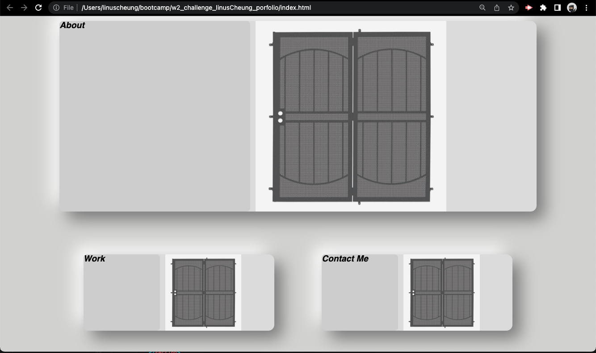

# Linus Cheung Profolio Website
* this website will allow viewers to understand the background of Linus Cheung. It is also used to showcase viewers the skillsets in different programming languages. 

## General Information
- Provide general information about your project here.
* the main part of the website can be divided into 4 different parts. including About me, Work, Contact me, and Resume. 
- What is the purpose of your project?
* The purpose of the profolio website is allowing viewers to have a better understanf on Linus. MOreover, it also allows viewers to rreader my work and determine whether I would be a good fit for their companies. 

## Technologies Used
- HTML
- CSS

## Screenshot

## links 
* Github Repository: https://github.com/linuscth/w2_challenge_linusCheung_porfolio
* url:  https://linuscth.github.io/w2_challenge_linusCheung_porfolio/

